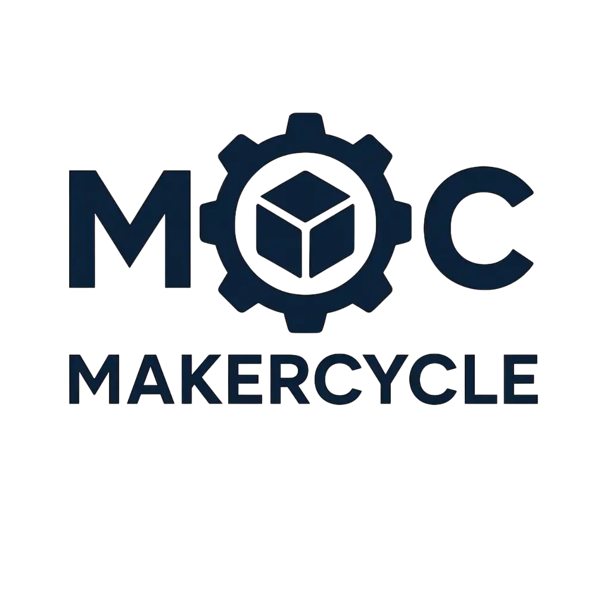

# 🚀 MakerFlow



**MakerFlow** es una plataforma SaaS moderna para la gestión integral de negocios de impresión 3D. Desde el cálculo preciso de costos hasta la gestión completa de ventas, clientes y equipos, MakerFlow revoluciona la forma en que gestionas tu negocio de impresión 3D.


## ✨ Características Principales

### 🧮 **Calculadora de Costos Inteligente**
- Cálculo automático de costos de filamento, electricidad y materiales
- Configuración flexible de precios y márgenes de beneficio
- Estimación precisa de tiempo de impresión
- Soporte para múltiples configuraciones de impresora
- Gestión de piezas individuales por proyecto

### 📊 **Dashboard Analítico Avanzado**
- Estadísticas en tiempo real de proyectos y ventas
- Gráficos interactivos de rentabilidad y tendencias
- Análisis detallado de costos y beneficios
- Métricas clave de negocio con filtros avanzados
- Reportes personalizables

### 💼 **Gestión Completa de Ventas**
- Sistema de ventas con múltiples elementos por factura
- Gestión de clientes con información completa
- Generación automática de albaranes y facturas
- Control de pagos y estados de venta
- Historial completo de transacciones

### 👥 **Colaboración en Equipo**
- Creación y gestión de equipos de trabajo
- Roles y permisos configurables
- Notificaciones en tiempo real
- Compartir proyectos y recursos
- Gestión de miembros del equipo

### 📋 **Gestión de Proyectos Tipo Kanban**
- Tablero visual tipo Trello para proyectos
- Estados personalizables (pendiente, en progreso, completado)
- Asignación de tareas a miembros del equipo
- Seguimiento de progreso en tiempo real

### 💰 **Contabilidad Integrada**
- Registro de gastos por categorías
- Control de costos operativos
- Análisis de rentabilidad por proyecto
- Reportes financieros automáticos
- Integración con sistema de ventas

### 🔐 **Seguridad Robusta**
- Autenticación con Supabase Auth
- Row Level Security (RLS) en toda la base de datos
- Almacenamiento seguro en la nube
- Sincronización automática de datos
- Backup automático de proyectos

## 🛠️ Stack Tecnológico

### Frontend
- **[Next.js 14](https://nextjs.org/)** - Framework React con App Router
- **[React 18](https://react.dev/)** - Biblioteca de interfaz de usuario
- **[TypeScript](https://www.typescriptlang.org/)** - Tipado estático
- **[Tailwind CSS](https://tailwindcss.com/)** - Framework CSS utilitario
- **[Framer Motion](https://www.framer.com/motion/)** - Animaciones fluidas

### Backend & Base de Datos
- **[Supabase](https://supabase.com/)** - Backend-as-a-Service
- **[PostgreSQL](https://www.postgresql.org/)** - Base de datos relacional
- **[Row Level Security](https://supabase.com/docs/guides/auth/row-level-security)** - Seguridad a nivel de fila
- **[Realtime](https://supabase.com/docs/guides/realtime)** - Actualizaciones en tiempo real

### Herramientas de Desarrollo
- **[pnpm](https://pnpm.io/)** - Gestor de paquetes rápido
- **[ESLint](https://eslint.org/)** - Linter de código
- **[Prettier](https://prettier.io/)** - Formateador de código

## 🚀 Despliegue Local

### Prerrequisitos

- **Node.js** >= 18.0.0
- **pnpm** (recomendado) o npm/yarn
- **Git** para clonar el repositorio
- Cuenta en [Supabase](https://supabase.com/) (gratuita)

### Paso 1: Clonar el Repositorio

```bash
git clone https://github.com/tu-usuario/MakerFlow.git
cd MakerFlow
```

### Paso 2: Instalar Dependencias

```bash
# Instalar pnpm si no lo tienes
npm install -g pnpm

# Instalar dependencias del proyecto
pnpm install
```

### Paso 3: Configurar Supabase

#### 3.1 Crear Proyecto en Supabase
1. Ve a [supabase.com](https://supabase.com/)
2. Crea una cuenta gratuita
3. Crea un nuevo proyecto
4. Anota la URL y las claves de API

#### 3.2 Configurar Variables de Entorno

```bash
# Copiar archivo de ejemplo
cp .env.example .env.local
```

Edita `.env.local` con tus credenciales de Supabase:

```env
# Supabase Configuration
NEXT_PUBLIC_SUPABASE_URL=https://tu-proyecto.supabase.co
NEXT_PUBLIC_SUPABASE_ANON_KEY=tu-anon-key-aqui
SUPABASE_SERVICE_ROLE_KEY=tu-service-role-key-aqui

# Optional: Analytics
NEXT_PUBLIC_GA_ID=tu-google-analytics-id
```

### Paso 4: Configurar Base de Datos

#### 4.1 Instalar Supabase CLI (Opcional)

```bash
# Con npm
npm install -g supabase

# Con pnpm
pnpm add -g supabase
```

#### 4.2 Ejecutar Migraciones

```bash
# Opción A: Usando Supabase CLI
supabase db push

# Opción B: Ejecutar migración manualmente
# Copia el contenido de supabase/migrations/001_initial_schema.sql
# y ejecútalo en el SQL Editor de Supabase
```

### Paso 5: Iniciar el Servidor de Desarrollo

```bash
pnpm dev
```

Abre [http://localhost:3000](http://localhost:3000) en tu navegador 🎉

### Paso 6: Crear Usuario Inicial

1. Ve a [http://localhost:3000](http://localhost:3000)
2. Haz clic en "Registrarse"
3. Crea tu cuenta de usuario
4. ¡Ya puedes empezar a usar MakerFlow!

## 📁 Estructura del Proyecto

```
MakerFlow/
├── 📁 app/                    # Páginas y layouts (Next.js App Router)
│   ├── 📁 auth/              # Páginas de autenticación
│   ├── 📁 dashboard/         # Dashboard principal
│   ├── 📁 settings/          # Configuraciones
│   └── 📄 layout.tsx         # Layout raíz
├── 📁 src/
│   ├── 📁 components/        # Componentes reutilizables
│   │   ├── 📁 cost-calculator/   # Calculadora de costos
│   │   ├── 📁 accounting/        # Contabilidad
│   │   ├── 📁 kanban/           # Gestión de proyectos
│   │   ├── 📁 auth/             # Componentes de autenticación
│   │   └── 📁 providers/        # Providers de contexto
│   ├── 📁 hooks/             # Custom hooks
│   ├── 📁 services/          # Servicios de API
│   └── 📁 types/             # Definiciones de tipos
├── 📁 supabase/              # Configuración de base de datos
│   ├── 📁 migrations/        # Migraciones SQL
│   └── 📄 config.toml        # Configuración de Supabase
├── 📁 public/                # Archivos estáticos
└── 📄 package.json           # Dependencias y scripts
```

## 🎯 Casos de Uso

### Para Impresores Profesionales
- ✅ Calcula costos precisos para cotizaciones
- ✅ Gestiona múltiples proyectos simultáneamente
- ✅ Analiza la rentabilidad de tu negocio
- ✅ Mantén un historial completo de trabajos
- ✅ Gestiona equipos de trabajo
- ✅ Controla ventas y clientes

### Para Aficionados
- ✅ Aprende sobre costos de impresión 3D
- ✅ Organiza tus proyectos de manera profesional
- ✅ Optimiza el uso de materiales
- ✅ Planifica mejor tus impresiones
- ✅ Registra tus ventas y gastos

### Para Equipos de Trabajo
- ✅ Colabora en proyectos compartidos
- ✅ Asigna tareas y responsabilidades
- ✅ Comunícate mediante notificaciones
- ✅ Comparte recursos y conocimientos

## 🔧 Configuración Avanzada

### Variables de Entorno Disponibles

| Variable | Descripción | Requerida | Default |
|----------|-------------|-----------|---------|
| `NEXT_PUBLIC_SUPABASE_URL` | URL de tu proyecto Supabase | ✅ | - |
| `NEXT_PUBLIC_SUPABASE_ANON_KEY` | Clave anónima de Supabase | ✅ | - |
| `SUPABASE_SERVICE_ROLE_KEY` | Clave de servicio de Supabase | ✅ | - |
| `NEXT_PUBLIC_GA_ID` | Google Analytics ID | ❌ | - |

### Scripts Disponibles

```bash
# Desarrollo
pnpm dev              # Servidor de desarrollo
pnpm build            # Construcción para producción
pnpm start            # Servidor de producción

# Calidad de código
pnpm lint             # Verificar código con ESLint
pnpm lint:fix         # Corregir errores automáticamente
pnpm type-check       # Verificar tipos de TypeScript

# Base de datos
pnpm db:reset         # Resetear base de datos local
pnpm db:push          # Subir migraciones a producción
pnpm db:diff          # Ver diferencias en esquema
```

### Configuración de Supabase

El proyecto incluye una configuración optimizada de Supabase en `supabase/config.toml` con:

- ✅ Autenticación habilitada
- ✅ Realtime habilitado
- ✅ Storage configurado
- ✅ Puertos optimizados para desarrollo local

## 🗄️ Base de Datos

### Esquema Consolidado

MakerFlow utiliza un esquema de base de datos consolidado y optimizado:

#### Tablas Principales (12)
- **profiles** - Usuarios del sistema
- **teams** - Equipos de trabajo
- **team_members** - Miembros de equipos
- **projects** - Proyectos de impresión 3D
- **pieces** - Piezas individuales de proyectos
- **clients** - Clientes
- **sales** - Ventas
- **sale_items** - Elementos de venta
- **expenses** - Gastos
- **company_settings** - Configuración de empresa
- **notifications** - Notificaciones
- **kanban_board** - Gestión de proyectos tipo Trello

#### Características de Seguridad
- ✅ **Row Level Security (RLS)** habilitado en todas las tablas
- ✅ **50+ políticas de seguridad** implementadas
- ✅ **Acceso controlado** por usuario y equipo
- ✅ **Triggers automáticos** para actualización de datos

## 🚀 Despliegue en Producción

### Opción 1: Vercel (Recomendado)

1. **Conecta tu repositorio a Vercel**
2. **Configura las variables de entorno**
3. **Deploy automático en cada push**

### Opción 2: Netlify

1. **Conecta tu repositorio a Netlify**
2. **Configura build command**: `pnpm build`
3. **Configura publish directory**: `out`

### Opción 3: Docker

```dockerfile
FROM node:18-alpine
WORKDIR /app
COPY package*.json ./
RUN npm install -g pnpm && pnpm install
COPY . .
RUN pnpm build
EXPOSE 3000
CMD ["pnpm", "start"]
```

## 🤝 Contribuir

¡Nos encantaría que contribuyas al proyecto! 

### ¿Cómo puedo ayudar?

- 🐛 **Reportar bugs** - Crea un issue con detalles
- 💡 **Sugerir características** - Usa GitHub Discussions
- 📝 **Mejorar documentación** - Envía un PR
- 🔧 **Contribuir código** - Fork y PR

### Guía de Contribución

1. **Fork el repositorio**
2. **Crea una rama** para tu feature (`git checkout -b feature/nueva-funcionalidad`)
3. **Commit tus cambios** (`git commit -am 'Agregar nueva funcionalidad'`)
4. **Push a la rama** (`git push origin feature/nueva-funcionalidad`)
5. **Crea un Pull Request**

## 📄 Licencia

Este proyecto está bajo la **Licencia MIT**. Ver el archivo `LICENSE` para más detalles.

## 📞 Soporte

- **Issues**: [GitHub Issues](https://github.com/tu-usuario/MakerFlow/issues)
- **Discusiones**: [GitHub Discussions](https://github.com/tu-usuario/MakerFlow/discussions)
- **Documentación**: [Wiki del proyecto](https://github.com/tu-usuario/MakerFlow/wiki)

## 🎉 Agradecimientos

- [Supabase](https://supabase.com/) por el excelente backend-as-a-service
- [Next.js](https://nextjs.org/) por el framework React
- [Tailwind CSS](https://tailwindcss.com/) por los estilos
- [Framer Motion](https://www.framer.com/motion/) por las animaciones

---

<div align="center">

**¿Te gusta MakerFlow? ¡Dale una ⭐ al repositorio!**

**Hecho con ❤️ para la comunidad de impresión 3D**

</div> 